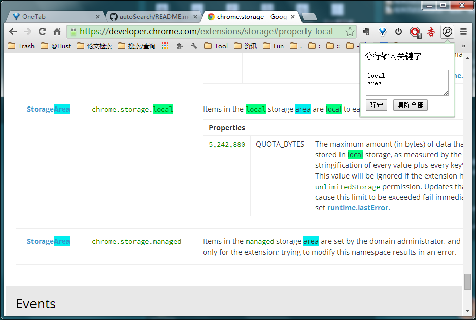
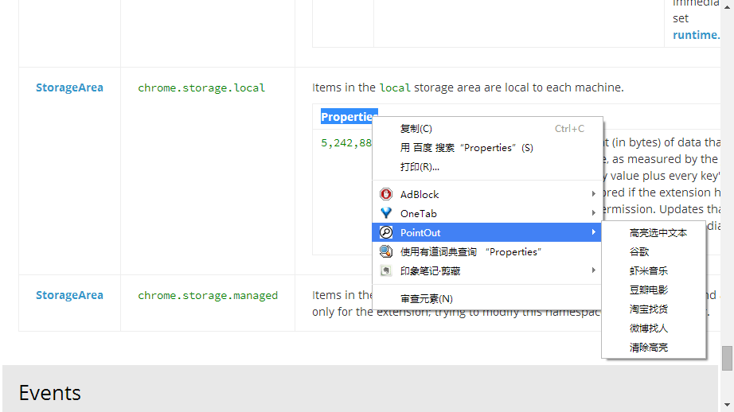

# chrome浏览器高亮关键词插件

### 功能
- 右键高亮鼠标选中的关键字
- 右键百度搜索，有道搜索，淘宝等等（*还可以扩展*）
- 在图标弹出窗口中，填写最多三个关键字分级高亮显示
- 清除各种高亮  

### 使用方法
- 安装这个插件
- 选取文字，右键。或者点击chrome右上角搜索图标，填写最多三个关键字
- 当填写的字为空白时，为清除样式

###效果如图所示
**高亮**

**搜索**

